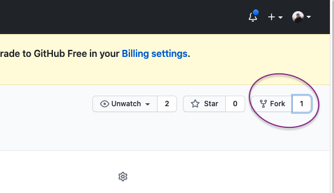

# Codeminos in house ToDo app

## Detailed Problem Description

Nowadays, it is becoming more and more difficult to track employee tasks and performance.
Not having one platform that all employee uses for adding tasks and interacting with them become harder for the management team.

## Expected solution description

A ToDo app solution is required. It consists of a web application where users can register / sign-up to create an account.

> Every user will be able to track his / her todos by performing the operation below :

- [ ] Create a todo task
- [ ] Create a recurring toDo
- [ ] Update a todo task
- [ ] Delete a todo task
- [ ] archive a todo task

## Propreties

> Every task can have a title, description, date , priority and multiple labels

## Constraint

- [ ] Every `task` can have a date in the `future` or `present` but not in the `past`.

- [ ] When a `task` get archived it would not get deleted but it would not appear on the user main screen.

## Filtering

> Users should be able to filter tasks by priority or by labels

> Users should be able to filter tasks by the added date or by the target date when this task gonna be achieved.

## Set up the project

### For Codeminos to count you exercise as valid exercise please fork the repo and after finishing from the exercise create a pull request (If you don't know how, follow the images below)



Before you can start the exercises, you must install all of the code necessary to run the exercises. Open the Terminal and run the following command.

```bash
npx create-react-app codeminos-todo
```

## Technical prerequisite

- [ ] Authentication using a token model
- [ ] Using Tailwind CSS library
- [ ] Using a state management system (preferable React Context)

## Areas of Freedom

- [ ] Its up to you on how the design would look like as long as the Codeminos employee and your future colleague can use it
- [ ] No need to implement the token refresh system

## Ways of Working

- [ ] Please commit and push your changes on every new features that you finish
- [ ] As a reminder don't forget to send a pull request when you finish from the project
- [ ] For the authentication and adding data please check the following API documentation on Postman [https://www.getpostman.com/collections/8f50def536eb8befda93](https://www.getpostman.com/collections/8f50def536eb8befda93)
- [ ] For questions on the test, please open a github issue on the main repo so we could answer it for you and for other applicants in the same time
